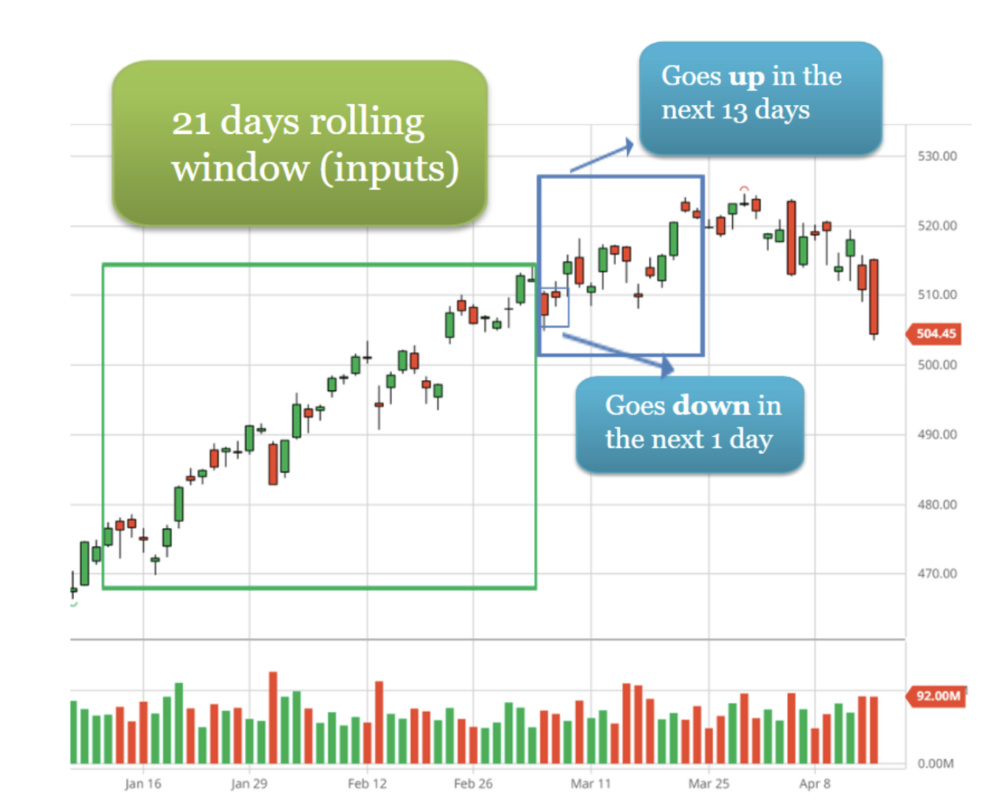
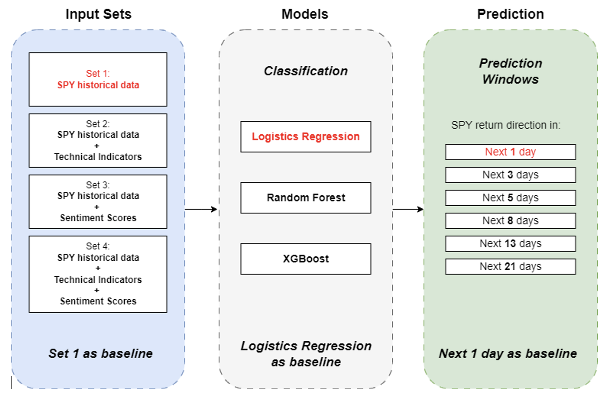

# Enhancing Stock Market Predictions with Sentiment Analysis — How to Evaluate Market Sentiment and Forecast with Machine Learning Techniques

### Team 2 (Hedgehog)
Team Members:
- Javier Cervantes
- Tianji Rao
- Zhanylai Turatkhan Kyzy
- Xiyue Zhang

## Overview
This project focuses on improving the accuracy of stock market predictions by integrating sentiment analysis derived from financial news and social media content with traditional financial indicators. Our target is the SPY ETF, which mirrors the S&P 500, using a combination of machine learning techniques and sentiment data to predict future price movements.

## Data
- **SPY Data**: Historical daily data from Bloomberg covering the period from January 2, 2015, to December 31, 2019.
- **Sentiment Data**: Extracted from over 1.7 million public tweets and financial news headlines, focusing on major tech companies and general market sentiment.

## Methodology
1. Sentiment Analysis: Utilizing NLP models like FinTwitBert and distilroberta-finetuned-financial-news for extracting sentiment from tweets and news respectively.

2. Forecasting Models:
- Logistic Regression: For predicting the direction of stock returns.
- Random Forest and XGBoost: For classifying the movement direction of the SPY within specified prediction windows.

## Experiments Design
Experiments are conducted to evaluate the effectiveness of integrating sentiment analysis with historical price and technical indicators. The models are tested across various prediction windows to understand the impact of sentiment over different time frames.

## Results
The integration of sentiment analysis with traditional financial indicators has shown a significant improvement in the accuracy of stock market predictions. Models like Random Forest and XGBoost particularly stood out, with their performance peaking in longer prediction windows.

## Conclusion
The study illustrates the value of combining diverse data types, such as sentiment scores and technical indicators, in enhancing the predictive accuracy of financial models. The use of sentiment analysis introduces a valuable dimension of market psychology, crucial for understanding market dynamics.

## References
- [Bloomberg](https://www.bloomberg.com/)
- [Hugging Face](https://huggingface.co/)